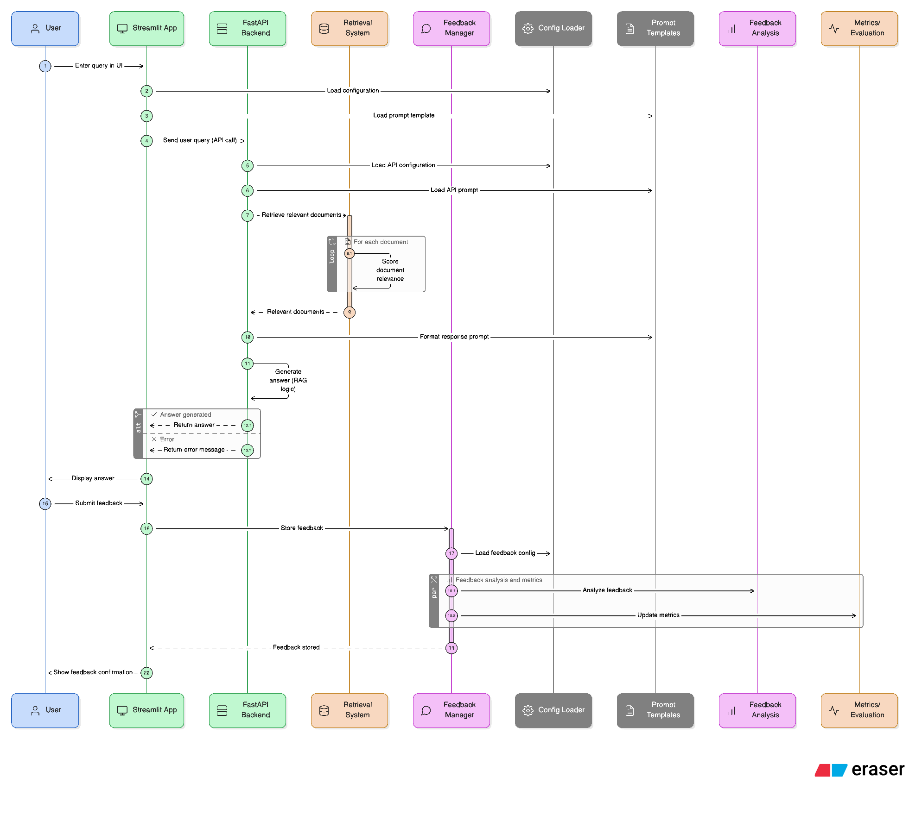

# ScienceSage

**ScienceSage** is an end-to-end Retrieval-Augmented Generation (RAG) system that delivers accurate, level-appropriate answers about space exploration, sourced from Wikipedia. Built for the [LLM Zoomcamp Capstone](https://github.com/DataTalksClub/llm-zoomcamp), it adapts explanations for different backgrounds and provides clear citations.

---

## 🤔💭 Problem: Why ScienceSage?

🚀 Space exploration is inspiring but complex. Reliable, accessible information is scattered and rarely tailored to learners’ needs. ScienceSage bridges this gap by:

- Delivering up-to-date answers with Wikipedia citations
- Adapting explanations for different backgrounds:
  - 🏫 **Middle School** (simple, intuitive)
  - 🎓 **College** (intermediate, with more depth)
  - 🧪 **Advanced** (detailed, technical)
- Enabling user feedback to improve over time

---

## 💡 Approach & Features

**ScienceSage** is an end-to-end **Retrieval-Augmented Generation (RAG)** project built for the [LLM Zoomcamp Capstone](https://github.com/DataTalksClub/llm-zoomcamp), powered by **GPT-4**, **Qdrant**, and **Streamlit**, and developed in Codespaces (Python 3.12).

✨ **Features**:
- **End-to-end RAG pipeline** (OpenAI GPT + Qdrant vector DB).  
- **Multi-level answers** (simple → advanced).  
- **Wikipedia as the primary data source** (focused on space exploration).  
- **Feedback system** (👍 / 👎 per answer, stored for analysis).  
- **Streamlit interface** with example queries and sidebar controls.  

📊 **Data Source** : [Wikipedia](https://www.wikipedia.org/) (focused on space exploration topics)

🔹 **Topics covered:**  
Space exploration, missions, Solar System, Mars, Moon, animals in space

---

## 🖼️ Screenshots & Architecture

**App UI Examples:**  


**System Architecture:**  


**Streamlit App Sequence Diagram:**  


For a step-by-step guide to the app’s features and interface, see the [UI Walkthrough](docs/sciencesage_ui_walkthrough.md).

---

## 📊 Results

| Metric             | Value   |
|--------------------|---------|
| Retrieval Recall   | 0.82    |
| Answer Accuracy    | 0.76    |
| User Feedback 👍   | 92%     |

*Detailed metrics and evaluation will be added after full pipeline testing.*

---

## 🔜 Future Work

- Support additional science domains and topics
- Add "Rephrase Question" and "Regenerate Answer" features
- Improve feedback analytics and user interaction
- Enable multimedia, images, and multi-language support
- Add async streaming answers, caching, and conversation history

---

## 📂 Project Structure

For an overview of the project structure, see below:  
```
ScienceSage/
├── sciencesage/         # App & backend logic
├── data/                # Data & outputs
├── images/              # Images & diagrams
├── scripts/             # Utilities
├── tests/               # Tests
├── requirements.txt     # Dependencies
├── Makefile             # Common workflows
├── README.md            # This file
└── ...
```

See [docs/project_structure.md](docs/project_structure.md) for the full directory tree and file descriptions.

---

## ⚡ Quickstart Setup

1. **Clone the repo and enter the directory:**
```bash
git clone https://github.com/lkirch/ScienceSage.git
cd ScienceSage
```

2. **Create and activate a virtual environment:**
   ```bash
   python3.12 -m venv .venv
   source .venv/bin/activate
   pip install -r requirements.txt
   ```

3. **Copy and edit environment variables:**
   ```bash
   cp .env.example .env
   # Edit .env to add your OpenAI API key
   ```

4. **Start Qdrant (vector database):**
   ```bash
   docker run -p 6333:6333 -p 6334:6334 qdrant/qdrant
   ```

5. **Prepare the data:**
   ```bash
   python scripts/download_and_clean.py
   python scripts/preprocess.py
   python scripts/embed.py
   ```

### 6. Run the Streamlit app
```bash
streamlit run sciencesage/app.py
```

- The app will open in your browser (or use $BROWSER http://localhost:8501).

> For detailed setup and advanced options, see [docs/setup.md](docs/setup.md).

---

## 🛠️ Project Tools

- **Makefile:**  
  Common setup and run tasks are available via `make`.  
  See [docs/using_the_makefile.md](docs/using_the_makefile.md) for details.

- **Requirements:**  
  All dependencies are in `requirements.txt`.

- **Testing:**  
  Run all tests with:
  ```bash
  pytest
  ```
  See [docs/testing.md](docs/testing.md) for more.

---

## 🖥️ Usage

- Select a topic and answer complexity in the sidebar
- Ask a question or use an example
- Get an answer with Wikipedia citations
- View retrieved context and debug info
- Provide feedback via 👍 / 👎

**Example queries:**
- "What is the International Space Station?" (Middle School)
- "How do Mars rovers navigate on the surface?" (College)
- "Describe NASA's three-phase plan for Mars colonization." (Advanced)

---

## 🛠️ API & Data

- **API Reference:**  
  See [docs/api-reference.md](docs/api-reference.md) for endpoints and usage.

- **Ground Truth Dataset:**  
  Format and examples: [docs/ground_truth_format.md](docs/ground_truth_format.md)

---

## 📝 Notes

- The main UI is in `sciencesage/app.py`
- Set your `OPENAI_API_KEY` in `.env`
- Use `$BROWSER http://localhost:8501` to open the app from the dev container

---

## ℹ️ About & Help

**ScienceSage** is an AI-powered tool that answers your space exploration questions using up-to-date Wikipedia content. Choose your learning level, ask a question, and get clear, cited answers.

- For a step-by-step guide to the app’s features, see the [UI Walkthrough](docs/sciencesage_ui_walkthrough.md).
- Need help or found a bug? [Open an issue on GitHub](https://github.com/lkirch/ScienceSage/issues).
- For more details on setup and usage, see the [project README](README.md) and [docs](docs/).

---

## 🙌 Acknowledgements

- [DataTalksClub LLM Zoomcamp](https://github.com/DataTalksClub/llm-zoomcamp)
- [GitHub Codespaces](https://github.com/features/codespaces)
- [Wikipedia API](https://pypi.org/project/Wikipedia-API/)
- [Qdrant](https://qdrant.tech/)
- [Streamlit](https://streamlit.io/)
- [OpenAI](https://openai.com/)
- [Claude](http://claude.ai) and [ChatGPT](http://chatgpt.com) for brainstorming, code debugging and improvements
- [Google's Nano Banana](https://aistudio.google.com/prompts/new_chat?model=gemini-2.5-flash-image-preview) for designing the logo
- [Eraser](https://www.eraser.io/ai/sequence-diagram-generator) for generating the Streamlit app sequence diagram

---

## 🤝 Contributing

Pull requests and issues are welcome! Please open an issue or PR if you have suggestions or improvements.

---