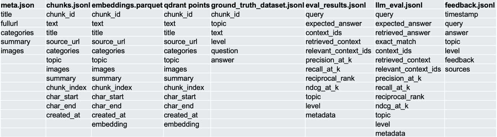

# 📚 ScienceSage Data & Dataset

This document describes the data sources, dataset construction, processing pipeline, and how data flows through the main scripts in ScienceSage.

---

## 🗂️ Data Sources

- **Wikipedia:**  
  The primary data source is Wikipedia, focusing on articles related to space exploration, missions, celestial bodies, technologies, and key events.

--

## 🖼️ Data Columns Overview

<div align="center">
  
</div>

*This diagram shows the main columns and structure of the processed dataset used for retrieval and answer generation.*

---

## 🏗️ Dataset Construction

1. **Curation:**  
   Relevant Wikipedia pages are selected using space-related keywords, categories, and manual review to ensure coverage of important topics.

2. **Chunking:**  
   Each article is split into smaller, manageable text chunks (typically by paragraph or section) to optimize retrieval and context assembly for the LLM.

3. **Embedding:**  
   Each chunk is embedded using OpenAI’s embedding model, producing vector representations suitable for similarity search.

4. **Storage:**  
   Embedded chunks and their metadata (title, section, source URL) are stored in a Qdrant vector database for efficient retrieval.

5. **Ground Truth Creation:**  
   For evaluation, a set of question–answer pairs is manually created, with ground truth Wikipedia chunks mapped to each question for retrieval metric calculation.

---

## 🔄 Data Processing Pipeline & References

1. **Collect Wikipedia articles** on space exploration topics.
   - *See [download_metadata.md](download_metadata.md) for article metadata structure and example.*
2. **Preprocess and clean** the text (remove markup, filter irrelevant content).
3. **Chunk articles** into smaller passages.
   - *See [chunk_data.md](chunk_data.md) for chunk data structure and example.*
4. **Collect chunk data for embedding.**
   - *See [collection_point_data.md](collection_point_data.md) for collection point data structure and example.*
5. **Embed each chunk** using OpenAI’s embedding API.
   - *See [embedding_data.md](embedding_data.md) for embedding data structure and storage.*
6. **Store embeddings and metadata** in Qdrant.
   - *See [download_metadata.md](download_metadata.md) for metadata structure and example.*
7. **Create ground truth evaluation sets** for objective measurement.
   - *See [ground_truth_data.md](ground_truth_data.md) for ground truth data structure and example.*
8. **Collect user feedback** on answers.
   - *See [feedback_data.md](feedback_data.md) for feedback data structure and example.*
9. **Evaluate retrieval and LLM answer quality.**
   - *See [eval_results_data.md](eval_results_data.md) for retrieval evaluation results structure.*
   - *See [llm_evaluation_data.md](llm_evaluation_data.md) for LLM evaluation results structure and examples.*

---

## 🗺️ Data Flow Through Scripts

```mermaid
flowchart TD
    A[Wikipedia Articles<br>(raw .html/.txt/.meta.json)] -->|download_data.py| B[data/raw/]
    B -->|preprocess.py| C[data/processed/chunks.jsonl]
    C -->|embed.py| D[data/embeddings/embeddings.parquet]
    D -->|embed.py| E[Qdrant Vector DB]
    C -->|create_ground_truth_dataset.py| F[data/ground_truth/ground_truth_dataset.jsonl]
    F -->|generate_eval_results.py| G[data/eval/eval_results.jsonl]
    G -->|rag_llm_evaluation.py| H[data/eval/llm_eval.jsonl]
    H -->|summarize_metrics.py| I[data/eval/metrics_summary.csv]
    E -->|retrieval_system.py| J[Streamlit App<br>Answer Generation]
    J -->|User Feedback| K[data/feedback/feedback.jsonl]
    K -->|analyze_feedback.py| L[data/feedback/feedback_summary.csv]
```

**Script/Data Flow Steps:**

1. **`scripts/download_data.py`**  
   Downloads Wikipedia articles and metadata to `data/raw/`.

2. **`scripts/preprocess.py`**  
   Cleans and chunks raw text into `data/processed/chunks.jsonl`.

3. **`scripts/embed.py`**  
   Embeds chunks, saves vectors to `data/embeddings/embeddings.parquet`, and uploads to Qdrant.

4. **`scripts/create_ground_truth_dataset.py`**  
   Creates evaluation Q&A pairs in `data/ground_truth/ground_truth_dataset.jsonl`.

5. **`scripts/generate_eval_results.py`**  
   Runs retrieval for ground truth questions, saves results to `data/eval/eval_results.jsonl`.

6. **`scripts/rag_llm_evaluation.py`**  
   Evaluates LLM answers, saves to `data/eval/llm_eval.jsonl`.

7. **`scripts/summarize_metrics.py`**  
   Summarizes metrics to `data/eval/metrics_summary.csv`.

8. **Streamlit App**  
   Uses Qdrant for retrieval and generates answers; collects user feedback.

9. **analyze_feedback.py**  
   Aggregates feedback to `data/feedback/feedback_summary.csv`.

---

## 📊 Dataset Usage

- **Retrieval:**  
  When a user asks a question, the system embeds the query and retrieves the most relevant chunks from Qdrant.
- **Answer Generation:**  
  Retrieved chunks are provided as context to GPT-4, which generates answers at the requested complexity level.
- **Evaluation:**  
  Retrieval and answer quality are measured using metrics such as Recall@K, Precision@K, MRR, and nDCG@K.

---

## 📁 File Locations

- **Raw Wikipedia data:**  
  `data/raw/` — Contains original Wikipedia articles in `.html`, `.txt`, and `.meta.json` formats.

- **Processed data chunks:**  
  `data/processed/chunks.jsonl` — Each line is a JSON object representing a text chunk.

- **Embeddings:**  
  `data/embeddings/embeddings.parquet` — Parquet file with vector embeddings for each chunk.

- **Ground truth and evaluation sets:**  
  `data/ground_truth/ground_truth_dataset.jsonl` — Ground truth records for evaluation.
  `data/eval/eval_results.jsonl` — Retrieval evaluation results.
  `data/eval/llm_eval.jsonl` — LLM answer evaluation results.

- **User feedback:**  
  `data/feedback/feedback.jsonl` — User feedback records.
  `data/feedback/feedback_summary.csv` — Aggregated feedback summary.

- **Other evaluation and summary files:**  
  `data/eval/example_query_summary.jsonl`  
  `data/eval/metrics_summary.csv`

---

## 📄 References

- [setup.md](setup.md) — Data preparation and setup instructions
- [download_metadata.md](download_metadata.md) — Article metadata structure and examples
- [chunk_data.md](chunk_data.md) — Data chunk structure and example
- [collection_point_data.md](collection_point_data.md) — Collection point data structure and example
- [embedding_data.md](embedding_data.md) — Embedding data structure and storage
- [ground_truth_data.md](ground_truth_data.md) — Ground truth data structure and example
- [feedback_data.md](feedback_data.md) — User feedback data structure and example
- [eval_results_data.md](eval_results_data.md) — Retrieval evaluation results structure
- [llm_evaluation_data.md](llm_evaluation_data.md) — LLM evaluation results structure and examples