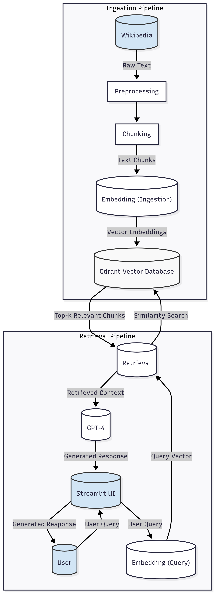

# 🏗️ ScienceSage System Architecture

ScienceSage is built as a modular Retrieval-Augmented Generation (RAG) system, designed for accurate, level-appropriate answers about space exploration. This document provides an overview of the system’s architecture, key components, and data flow.

---

## 📐 Architecture Diagram

---

## 🧩 Key Components

- **User Interface (Streamlit):**  
  Users interact with the app via a web UI, selecting answer complexity and submitting questions.

- **Query Embedding:**  
  User questions are embedded using an OpenAI embedding model.

- **Vector Database (Qdrant):**  
  The embedded query is used to retrieve the most relevant Wikipedia chunks from a Qdrant vector store.

- **Context Assembly:**  
  Retrieved chunks are assembled and formatted as context for the LLM.

- **LLM Answer Generation (GPT-4):**  
  The system prompts GPT-4 to generate answers at three complexity levels (Middle School, College, Advanced), citing Wikipedia sources.

- **Feedback System:**  
  Users can rate answers (👍/👎), and feedback is stored for analysis and future improvements.

---

## 🔄 Data Flow

1. **User submits a question** via the Streamlit UI, selecting the desired answer complexity.
2. **The question is embedded** using an OpenAI embedding model.
3. **Qdrant retrieves relevant Wikipedia chunks** based on vector similarity.
4. **Context is assembled** from the retrieved chunks.
5. **GPT-4 generates answers** at the requested complexity level, using the context and providing citations.
6. **The answer and context are displayed** in the UI, along with feedback options.
7. **User feedback is collected** and stored for evaluation and system improvement.

---

## 🗂️ Related Diagrams

- **System Architecture:**  
  

- **Streamlit App Sequence Diagram:**  
  

---

## 📄 See Also

- [README.md](../README.md) — Project overview and quickstart
- [docs/retrieval_evaluation_metrics.md](retrieval_evaluation_metrics.md) — Retrieval evaluation metrics
- [docs/sciencesage_ui_walkthrough.md](sciencesage_ui_walkthrough.md) — UI walkthrough

---