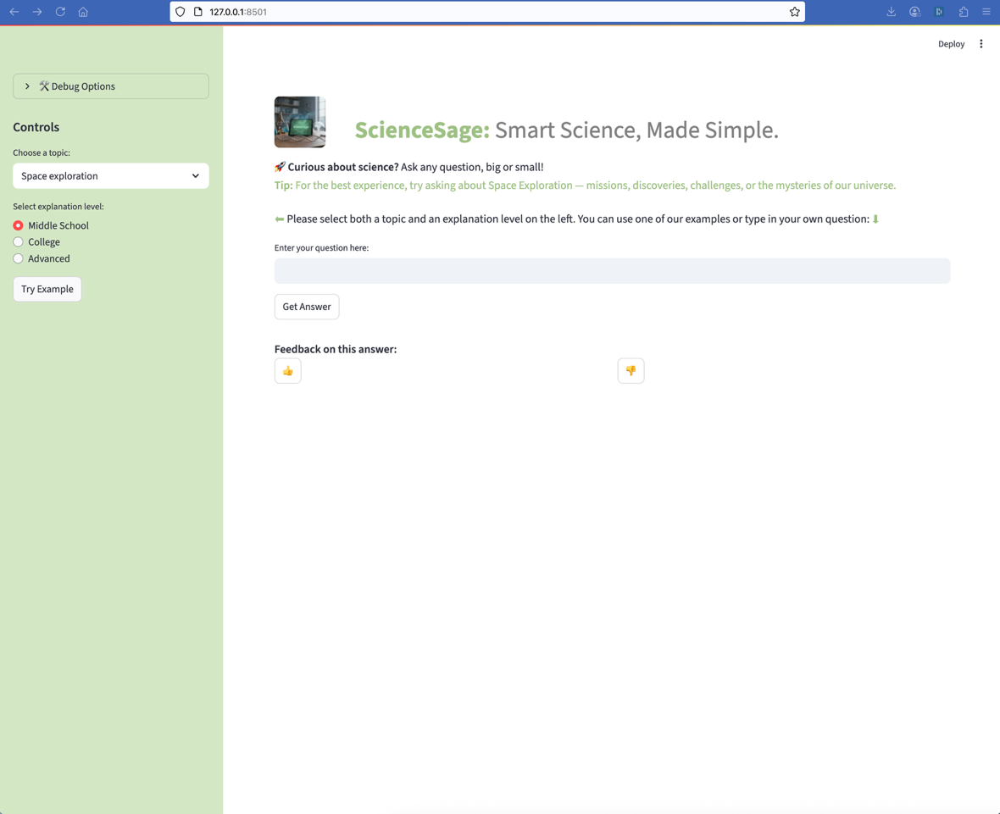
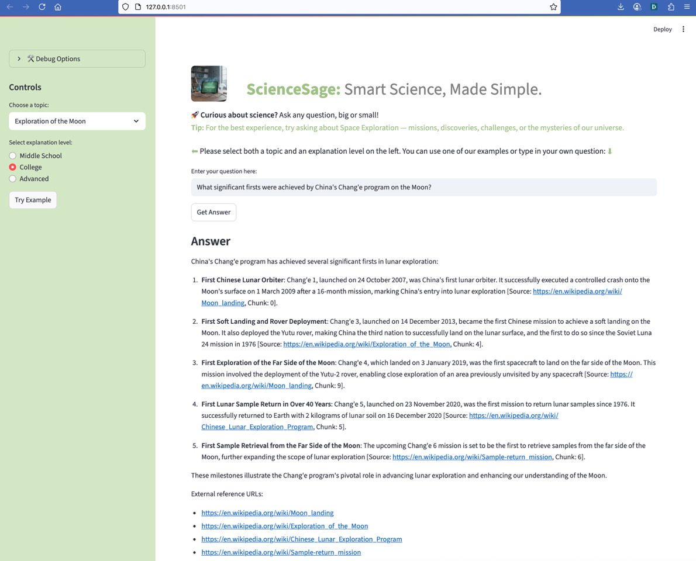
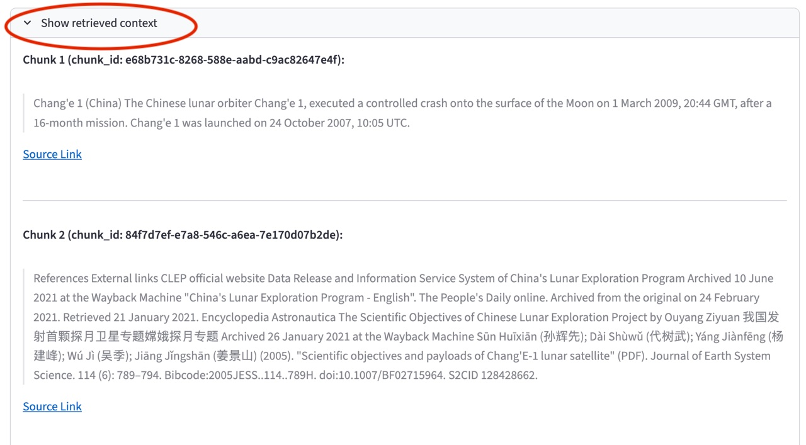
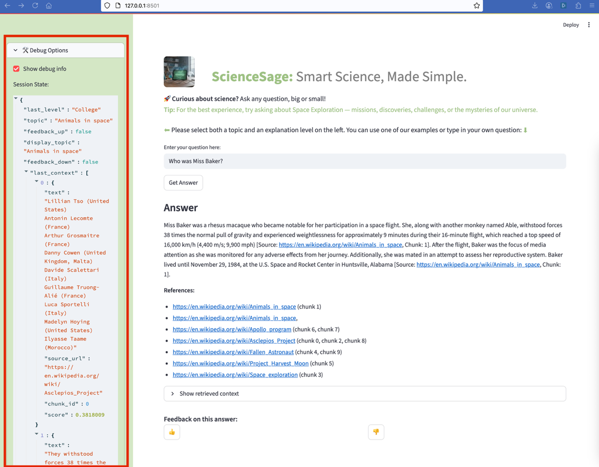
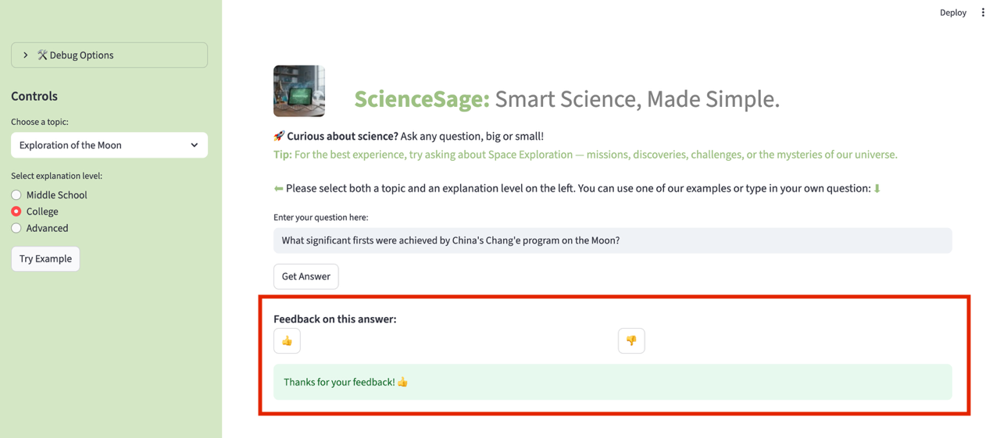
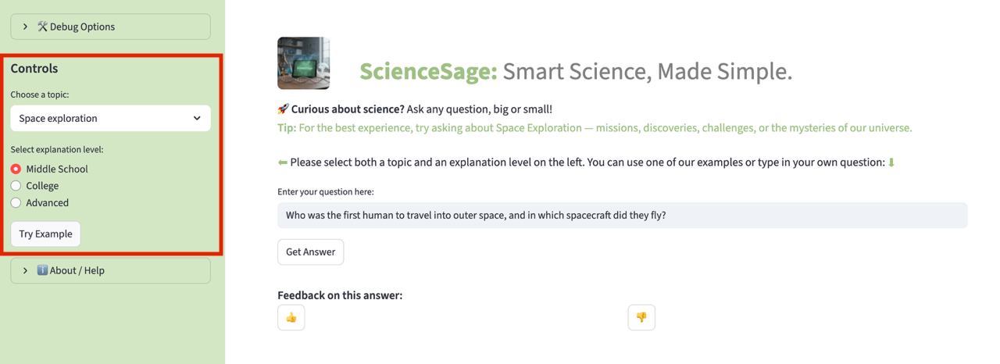
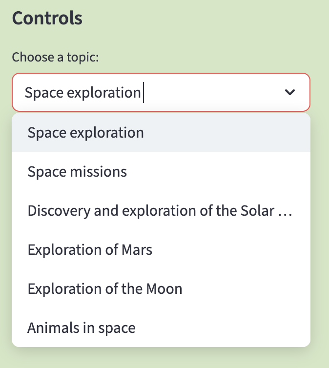
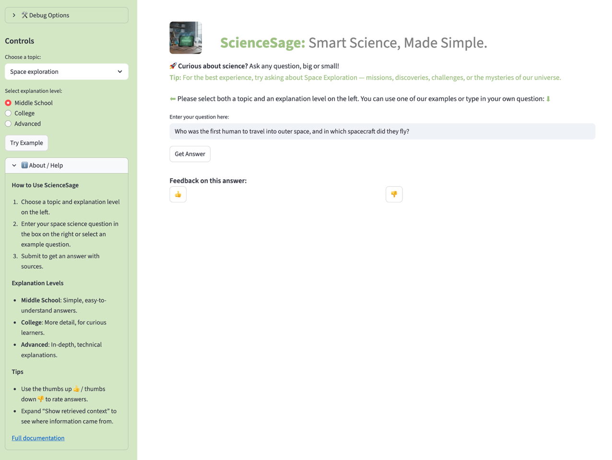

# 🚀 ScienceSage UI Walkthrough

Welcome to the ScienceSage user interface! This walkthrough will guide you through the main features and screens of the app, with annotated screenshots for each step.

---

## 1. Home Screen

*The home screen welcomes you to ScienceSage. Here, you can select a topic, choose your answer complexity (Middle School, College, Advanced), and enter your question.*

---

## 2. Example Queries

*Use the sidebar to pick from example queries or enter your own. This helps you quickly get started and see how the system works.*

---

## 3. Answer Display

*After submitting a question, ScienceSage provides a clear, level-appropriate answer. Each answer includes Wikipedia citations for transparency and further reading.*

---

## 4. Retrieved Context

*For advanced users, you can expand the "Retrieved Context" section to see the source passages used to generate your answer.*

---

## 5. Debug Info

*Debug information is also available for troubleshooting and transparency.*

---

## 6. Feedback System

*Rate the answer with a 👍 or 👎. Your feedback helps improve the system over time.*

---

## 7. Sidebar Controls

  

*The sidebar lets you switch topics, adjust answer complexity, and access example queries at any time.*

---

## 8. About & Help

*Find more information about ScienceSage, its data sources, and how to use the app in the About/Help section.*

---

🚀  **Ready to explore?**  
Try out your own questions and discover the wonders of space exploration with ScienceSage!
